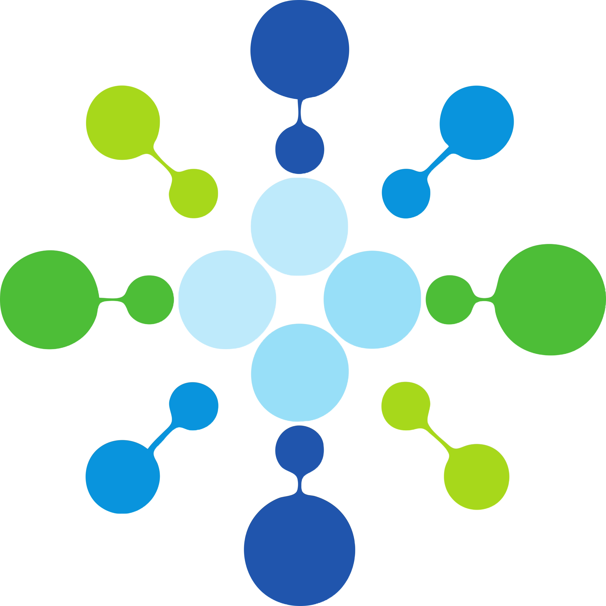

---
---
<!--This line is commented-->

Welcome. This site showcases the computational projects, tools, and research outputs developed by our research group, with a focus on molecular data analysis, cheminformatics, and machine learning.

## Projects
- **MOLRAPTOR** — A modular pipeline for molecular data curation and fingerprint encoding.
- **MOSAIC** — A lightweight benchmarking toolkit for tabular classification and model selection.
- **CHAMANP** — Curation and hierarchical analysis for molecular annotation of natural products.

## Tutorials
- [**NumPy Tutorial**](https://github.com/NanoBiostructuresRG/NumpyTutorial) — An introductory tutorial to NumPy covering linear algebra, testing, and debugging in Python.

Visit our website at [NanoBiostructuresRG](https://sites.google.com/tec.mx/nanobiostructures).
