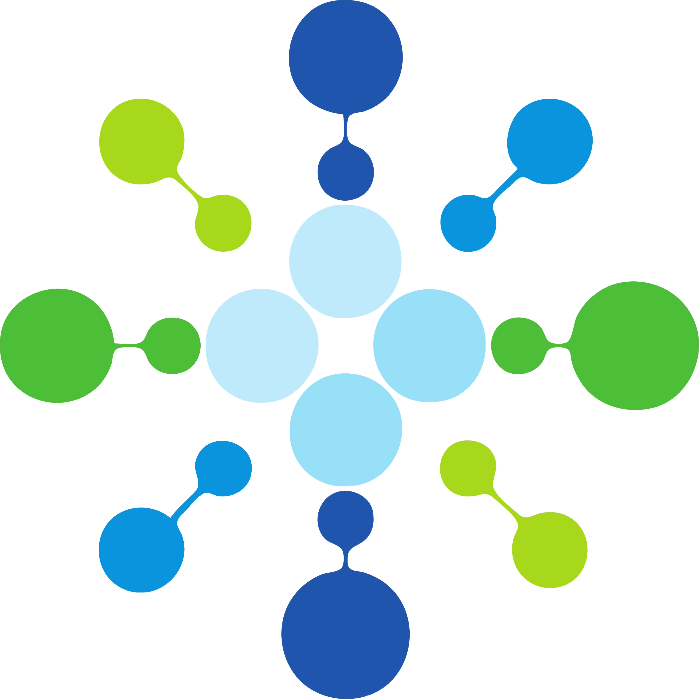

---
---
<!--This line is commented-->

The Nano]°[Biostructures RG is part of the Unit of Experimental Medicine within the Institute for Obesity Research at Tecnológico de Monterrey. This site showcases the computational projects and tools developed by our group for data-driven molecular discovery in metabolic disorders.

## Projects
- **MOLRAPTOR** — A pipeline for fetching, curating, and encoding molecular datasets into machine-learning-ready fingerprints.
- **NPSCORER** — An RDKit-based implementation of the P. Ertl (2008) algorithm to quantify the NP-likeness of chemical libraries.
- **MOSAIC** — A machine learning benchmarking toolkit for classification and model selection on tabular data.
- **CHAMANP** — A framework for curating and hierarchically organizing natural product molecular datasets.

## Tutorials
- [NumPy Tutorial](https://nanobiostructuresrg.github.io/NumpyTutorial/) — An introductory tutorial to NumPy covering linear algebra, testing, and debugging code in Python.
- [AutoDock Tutorial](https://github.com/NanoBiostructuresRG/AutodockTutorial) — An introductory tutorial to AutoDock Vina covering the basics of molecular docking and result analysis.

---
### Research Profiles
[NanoBiostructuresRG](https://sites.google.com/tec.mx/nanobiostructures)  |  [ORCiD](https://orcid.org/0000-0003-2375-131X)  |  [GitHub](https://github.com/NanoBiostructuresRG)  |  [GoogleScholar](https://scholar.google.com/citations?user=vV2vSG8AAAAJ&hl=es&oi=sra)
